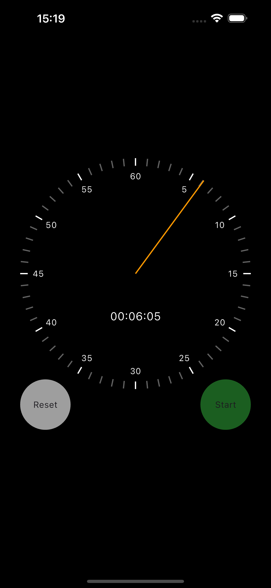

# ⏱️ Interactive Stopwatch App

An elegant and interactive stopwatch app built with Flutter. This app uses `Ticker` and `AnimationController` to provide a smooth, animated display of the elapsed time. With intuitive controls to start, stop, and reset the timer, it's both a functional and visually engaging utility.



## 🚀 Features

- 🕒 Real-time animated stopwatch
- ▶️ Start/Stop toggle button
- 🔄 Reset button to clear the timer
- Smooth UI animations using `AnimationController`
- Clean and responsive design

## 📸 Preview

> *(Replace with actual screenshot)*  
> 

## 📦 Getting Started

To run the app locally:

```bash
git clone https://github.com/yourusername/stopwatch_app.git
cd stopwatch_app
flutter pub get
flutter run
```

## 📦 Built With

- [**Flutter**](https://flutter.dev/) – for cross-platform UI development  
- `Ticker` – for frame-based time updates  

## 📁 Project Structure

```plaintext
lib/
├── main.dart
└── ui
    ├── clock_hand.dart
    ├── clock_markers.dart
    ├── elapsed_time_text_basic.dart
    ├── reset_button.dart
    ├── start_stop_button.dart
    ├── stopwatch_renderer.dart
    └── stopwatch.dart       # Any reusable widgets or buttons
```

## 📌 Usage

- **Start:** Tap the ▶️ button to begin the stopwatch.  
- **Stop:** Tap the ⏸️ button to pause the timer.  
- **Reset:** Tap the 🔄 button to set the time back to 00:00:00.

## 💡 Inspiration

This project is part of a practice series to improve animation skills in Flutter and build user-friendly micro-apps.
## 📝 License

MIT License. See [LICENSE](LICENSE) for details.
